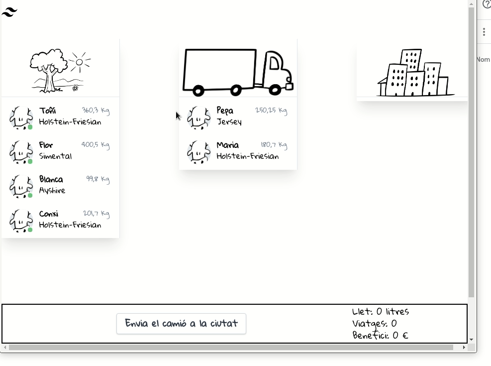

# Tests d'UI de la web de Vaques

Projecte per fer tests d'UI de la web de vaques en C#.



Fa servir:

- Selenium
- Google Chrome

## Clonar

Per clonar el projecte s'han de descarregar els mòduls. La forma més senzilla és executar:

```bash
git clone --recurse-submodules https://github.com/CursEines/VaquesUITests.git
```

## Tests

Per executar els tests n'hi ha prou amb `dotnet test`.

```bash
$ dotnet test
...
Test Run Successful.
Total tests: 7
     Passed: 7
 Total time: 26,2306 Seconds
```

Els tests que fa són relativament senzills.

- Obre el navegdor i comprova que clicant a sobre d'una de les vaques es mou entre les columnes.
- Comprova que el valor del número de viatges s'incrementa
